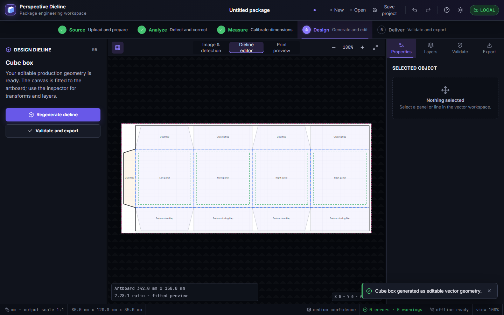
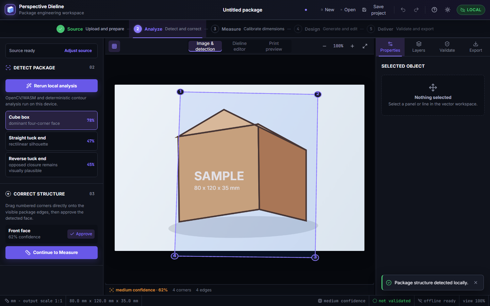
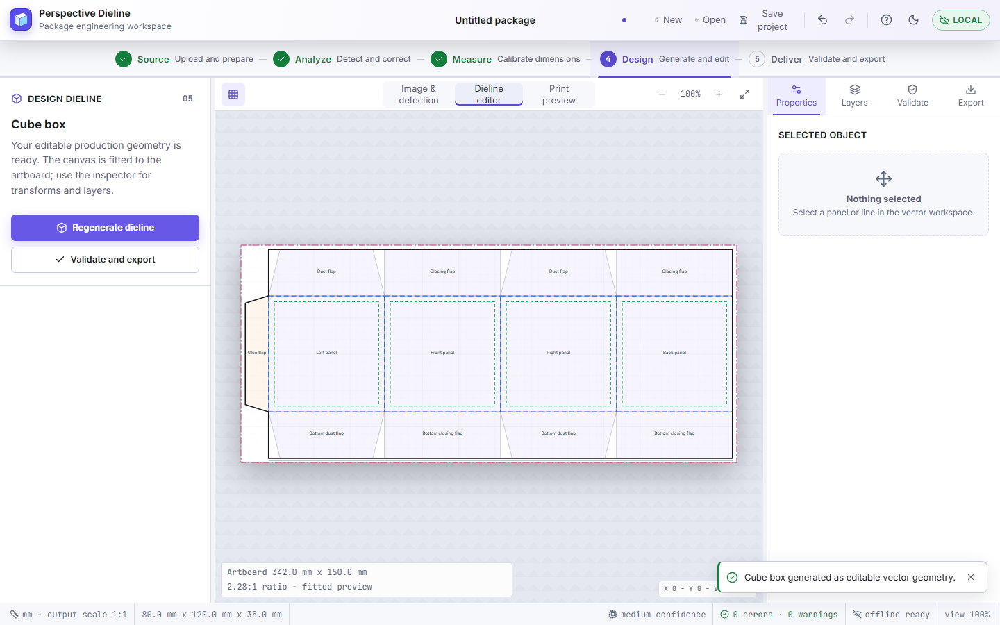
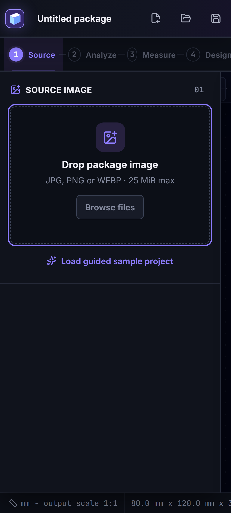

# Perspective Dieline Generator

Local-first software for turning a perspective package photograph into confirmed measurements and an editable 1:1 vector dieline. One React/TypeScript/Vite workbench powers both the GitHub Pages web app and the Tauri 2 Windows desktop app.

**Designed and developed by S. M. Monowar Kayser.**

[Open the web app](https://monokayser.github.io/perspective-dieline-generator/) | [Windows v1.1.2 download](https://github.com/Monokayser/perspective-dieline-generator/releases/download/v1.1.2/Perspective-Dieline-Generator-Setup-v1.1.2.exe) | [GitHub release](https://github.com/Monokayser/perspective-dieline-generator/releases/tag/v1.1.2) | [User guide](docs/USER_GUIDE.md) | [Test report](docs/TEST_REPORT.md)

**Windows EXE installer:** [Download Perspective Dieline Generator v1.1.2](https://github.com/Monokayser/perspective-dieline-generator/releases/download/v1.1.2/Perspective-Dieline-Generator-Setup-v1.1.2.exe)



## Features

- Five focused phases: Source, Analyze, Measure, Design, and Deliver.
- Deterministic rotation, flips, brightness, contrast, and saturation before display and local analysis, while preserving the untouched original.
- Cancellable OpenCV.js worker analysis, ranked candidates, draggable normalized annotations, confidence scoring, and quality warnings.
- Eight parametric package structures plus a custom starting structure.
- Editable millimetre geometry, semantic layers, selection transforms, undo/redo, validation, and 1:1 output.
- SVG as the primary format, with PDF, DXF, PNG, JPG, JSON, and versioned `.pdgproj` support.
- Responsive dark and light themes with self-hosted Inter, platform font fallbacks, keyboard navigation, focus-managed drawers, forced colors, reduced motion, and 360 px support.
- Scale-independent SVG application mark that remains square and unclipped on standard and high-density displays.
- Professional high-DPI desktop icon shared by the executable, installer, shortcuts, and application metadata.
- Aspect-correct editor and print previews with explicit artboard dimensions, ratio, and fitted-view labeling.
- Native Windows Open, Save, and Save As dialogs. Every desktop export lets the user choose its drive, folder, and filename.

Images are processed locally and are not sent to an application backend. A photograph cannot reveal hidden dimensions, so inferred proportions never become confirmed manufacturing measurements automatically.

## SVG Save As on Windows

In the Windows app, **Export editable SVG** opens the native Windows Save dialog before writing. Choose any available drive or folder, edit the suggested filename, then select **Save** or **Cancel**. The app preserves `.svg`, reports the selected path, uses Windows overwrite confirmation for duplicate names, and explains permission, missing-folder, locked-file, invalid-path, and disk-space failures. Cancel writes nothing.

The web app uses the browser download location because public websites cannot request unrestricted filesystem access. Use the Windows build when an exact PC destination is required.

## Install and use

Download the v1.1.2 installer from the [Latest release](https://github.com/Monokayser/perspective-dieline-generator/releases/latest). The installer includes the offline WebView2 runtime and installs per user. A portable ZIP and sample pack are also attached.

The v1.1.2 artifacts are **unsigned** because no trusted Authenticode certificate was supplied. Windows SmartScreen may warn. Verify the downloaded file against `SHA256SUMS.txt`; no Authenticode claim is made for this release.

## Local development

Requirements: Node.js 22.13+ and npm. Windows packaging additionally needs Rust stable and Visual Studio 2022 Build Tools with the Desktop C++ workload.

```bash
npm ci
npm run dev
```

The development server opens at `http://localhost:5173`. Run the release gates with:

```bash
npm run check
npm run audit:release
npm run test:coverage
npm run test:e2e
npm run desktop:web
cargo check --locked --manifest-path src-tauri/Cargo.toml
```

`npm run build` emits the static GitHub Pages artifact to `dist/`. Set `PDG_BASE_PATH=/perspective-dieline-generator/` for the repository host. `npm run desktop:web` emits relative offline assets to `desktop-dist/`, and `npm run desktop:build` creates the Windows bundle under `src-tauri/target/release/bundle/`.

## Project structure

```text
desktop/                 Shared Vite HTML and React entry
src/components/          Workbench UI
src/domain/              Geometry, project, validation, and export contracts
src/store/               Project state and command history
src/styles/              Shared semantic theme and responsive CSS
src/workers/             Local analysis worker
src-tauri/               Windows shell, native Save As adapter, and packaging
tests/                   Unit, static-build, budget, and Playwright checks
docs/                    User, architecture, deployment, and QA documentation
.github/workflows/       Release gates and GitHub Pages deployment
```

Runtime dependencies are declared in `package.json` and `src-tauri/Cargo.toml`; exact versions are locked in `package-lock.json` and `src-tauri/Cargo.lock`. The project is released under the [MIT License](LICENSE).

## Screenshots







The supplied visual references and QA screenshots were private design guidance only and are not included in application or release artifacts.

## Documentation and limitations

See [User guide](docs/USER_GUIDE.md), [Calibration](docs/CALIBRATION_GUIDE.md), [Architecture](docs/ARCHITECTURE.md), [CV pipeline](docs/COMPUTER_VISION.md), [Templates](docs/TEMPLATES.md), [Deployment](docs/DEPLOYMENT.md), [Privacy and limitations](docs/PRIVACY_AND_LIMITATIONS.md), [Security](SECURITY.md), and [Troubleshooting](docs/TROUBLESHOOTING.md).

Known limits include single-image ambiguity, unsigned Windows binaries, browser-controlled web download locations, and the need to verify physical prototypes before manufacturing.
