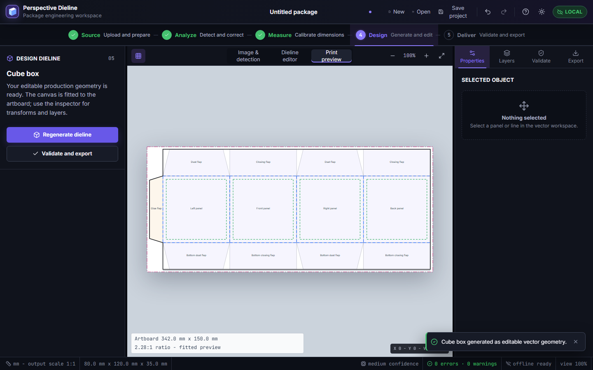

# Perspective Dieline Generator

Local-first software for turning a perspective package photograph into confirmed measurements and an editable, 1:1 vector dieline. The same React/TypeScript workbench runs as a public Sites web app and a Tauri 2 Windows desktop app.

[Open the web app](https://perspective-dieline-generator.circleofexpose.chatgpt.site) | [Windows v1.0.2 download](https://github.com/Monokayser/perspective-dieline-generator/releases/download/v1.0.2/Perspective-Dieline-Generator-Setup-v1.0.2.exe) | [GitHub release](https://github.com/Monokayser/perspective-dieline-generator/releases/tag/v1.0.2) | [User guide](docs/USER_GUIDE.md) | [Test report](docs/TEST_REPORT.md)



## What ships in v1.0.2

- Eight-stage workflow: Upload, Detect, Correct, Measure, Generate, Edit, Validate, Export.
- Cancellable local worker analysis with lazy OpenCV.js loading, deterministic fallback analysis, normalized annotations, quality warnings, confidence scoring, previews, and quadrilateral rectification.
- Parametric rectangular carton, cube, straight tuck, reverse tuck, sleeve, mailer, triangular closure, and custom starting structures.
- Native SVG editing, stable semantic IDs, layers, selection transforms, undo/redo, validation, and 1:1 export.
- Async SVG, PDF, DXF, PNG, JPG, JSON, and `.pdgproj` operations with progress, cancellation, validation gates, and accessible success/error messages.
- Native Windows Open, Save, and Save As dialogs; Ctrl+S reuses the chosen project path while every export lets the user choose its PC folder and filename.
- Strict, versioned `.pdgproj` archives with traversal, expansion, entry-count, compression-ratio, schema, and unsafe-content defenses.
- IndexedDB recovery on web; native file dialogs and private recovery storage in the Tauri desktop shell.
- Responsive light/dark UI with keyboard support, focus-managed drawers/dialogs, forced-colors, increased-contrast, reduced-motion, safe-area, and screen-reader behavior.

Images are never sent to an application backend. A single image cannot reveal hidden dimensions, so inferred proportions never become confirmed manufacturing measurements automatically.

## SVG Save As on Windows

In the Windows desktop app, **Export editable SVG** opens the native Windows Save dialog before anything is written. Choose any available drive or folder, edit the suggested filename, then select **Save** or **Cancel**. The app preserves the `.svg` extension, reports the final selected path, relies on the Windows overwrite confirmation for duplicate names, and gives repair guidance for permission, missing-folder, locked-file, invalid-path, and disk-space failures. Cancelling writes no file.

The web app uses the browser's download behavior because websites cannot request unrestricted filesystem paths. Use the Windows build when an exact PC destination is required.

## Current Windows release status

The public v1.0.2 Windows package is **unsigned** because no trusted Authenticode certificate was available in the release environment. Its source, installer behavior, portable package, and checksums were tested, but Windows SmartScreen may warn before launch. Verify the SHA-256 value in the release's `SHA256SUMS.txt` before running it. A signed build remains gated on a trusted certificate.

## Development

Requirements: Node.js 22.13+ and npm. Windows packaging additionally needs Rust stable and Visual Studio 2022 Build Tools with the Desktop C++ workload.

```bash
npm ci
npm run check
npm run audit:release
npm run test:coverage
npm run desktop:web
npm run desktop:build
```

The Sites build is emitted to `dist/`. The Tauri SPA is emitted to `desktop-dist/`; native artifacts are emitted below `src-tauri/target/release/bundle/`.

## Windows release signing

Production Windows artifacts must be Authenticode-signed. Put the trusted PFX outside the repository, then expose only its path and password to the release process:

```powershell
$env:PDG_AUTHENTICODE_PFX = "C:\secure\codesigning.pfx"
$env:PDG_AUTHENTICODE_PASSWORD = Read-Host -AsSecureString | ConvertFrom-SecureString -AsPlainText
npm run release:signed
Remove-Item Env:PDG_AUTHENTICODE_PASSWORD
```

The release script signs with SHA-256 and a trusted timestamp, verifies both the application and NSIS installer, creates the portable ZIP and checksums, and never copies the PFX into the repository or release output. See [Deployment](docs/DEPLOYMENT.md).

## Safety and data contracts

Canonical geometry uses double-precision millimetres. Image annotations are normalized to `[0,1]`. Production exports are blocked when validation contains errors, while `.pdgproj` recovery saves remain available. Newer recoverable project versions open read-only.

See [Calibration](docs/CALIBRATION_GUIDE.md), [Architecture](docs/ARCHITECTURE.md), [CV pipeline](docs/COMPUTER_VISION.md), [Templates](docs/TEMPLATES.md), [Privacy and limitations](docs/PRIVACY_AND_LIMITATIONS.md), [Security](SECURITY.md), and [Troubleshooting](docs/TROUBLESHOOTING.md).

## Reference image

The supplied watermarked Alamy image was used only as private structural guidance. It is not included in the application, fixtures, samples, screenshots, installers, or public deployment.

## License

Released under the [MIT License](LICENSE).
